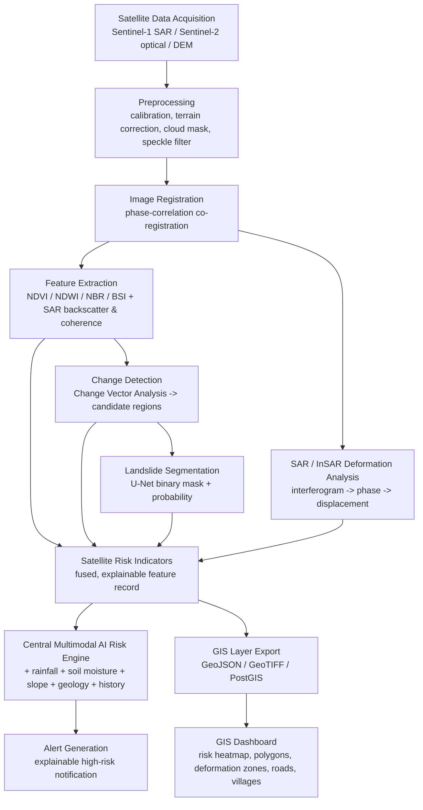

# Satellite & Computer Vision Module — Architecture

## 1. Architecture diagram

## 2. Stage-by-stage design

| Stage | Input | Processing | Output | Technology | Compute | Implementation notes |
|---|---|---|---|---|---|---|
| **Data Acquisition** | AOI bounding box, date range | Query Sentinel-2 SR / Sentinel-1 GRD / DEM collections | Local GeoTIFFs | Google Earth Engine Python API (primary), `sentinelsat` (fallback) | Network-bound, negligible CPU | `src/data_acquisition/sentinel_downloader.py` |
| **Preprocessing** | Raw bands | Radiometric calibration (GEE-provided), cloud masking (heuristic/`s2cloudless`), Lee speckle filter (SAR) | Cleaned bands, cloud mask | numpy, scipy, rasterio | CPU, seconds per tile | `src/preprocessing/cloud_mask.py` |
| **Image Registration** | Pre/post band pairs | FFT phase-correlation sub-pixel shift + resample | Co-registered post scene | scipy.fft, scipy.ndimage | CPU, milliseconds per band | `src/preprocessing/registration.py` |
| **Feature Extraction** | Registered, cleaned bands | Compute NDVI/NDWI/NBR/BSI (optical); backscatter change + coherence (SAR) | Index rasters, SAR feature rasters | numpy | CPU, milliseconds | `src/features/spectral_indices.py`, `src/features/sar_features.py` |
| **Change Detection** | Index deltas | Change Vector Analysis (CVA) magnitude, adaptive threshold, connected-component filtering | Candidate change regions + `change_score` | numpy, scipy.ndimage | CPU, milliseconds | `src/change_detection/change_detector.py` |
| **Landslide Segmentation** | Stacked bands + indices (6-channel tile) | U-Net forward pass, sigmoid, threshold | Probability map + binary mask | PyTorch | GPU preferred, CPU workable for MVP tile sizes | `src/segmentation/model.py`, `src/segmentation/train.py` |
| **SAR/InSAR Deformation** | Complex SAR pre/post pair | Interferogram -> wrapped phase -> simplified unwrap -> phase-to-mm conversion, coherence gating | `surface_displacement_mm`, reliability fraction, limitations | numpy, scipy | CPU, milliseconds (simplified); real InSAR needs SNAP/GAMMA + GPU-hours | `src/sar_insar/deformation.py` |
| **Satellite Risk Indicators** | All of the above | Fuse into standardized schema, build explanation bullets, blend confidence | `SatelliteRiskIndicators` record | Python dataclasses | Negligible | `src/risk_indicators/indicator_builder.py` |
| **API / Integration** | HTTP request (AOI + dates) | Orchestrate pipeline stages | JSON matching `SatelliteRiskIndicatorsResponse` | FastAPI, Pydantic | Depends on pipeline above | `src/api/main.py` |
| **GIS Export** | Risk indicator records + change regions | Build GeoJSON features / PostGIS rows | `.geojson`, PostGIS INSERTs | geopandas-compatible dicts, PostGIS DDL | Negligible | `src/gis/gis_export.py` |

## 3. Why Sentinel-1 SAR matters in the NER

The North Eastern Region experiences intense monsoon rainfall and persistent
cloud cover for much of the landslide season. Optical sensors like
Sentinel-2 cannot see through cloud, so a purely optical pipeline can go
days-to-weeks without a usable acquisition during exactly the highest-risk
periods. Sentinel-1's C-band SAR penetrates cloud cover and operates
day or night, making it the only consistently available near-real-time
satellite signal during active monsoon events — hence it is treated as a
first-class, not optional, input in this design (with SAR backscatter
change and coherence loss both feeding the fused `change_score`).

## 4. Model comparison — landslide segmentation

| Model | Strengths | Weaknesses for this task | Verdict |
|---|---|---|---|
| **U-Net** | Strong performance on small/scarce labeled datasets; precise boundary localization; lightweight, fast to train/infer; huge remote-sensing precedent | Purely CNN — no long-range context | **Recommended MVP** |
| **DeepLabV3+** | Atrous convolutions give strong multi-scale context; good on larger datasets | Needs more data/compute to reach its potential; heavier decoder | Good post-hackathon upgrade |
| **SegFormer** | Transformer backbone, strong global context, state-of-the-art on many benchmarks | Data-hungry, slower to train from scratch, more complex to deploy under time pressure | Overkill for MVP |
| **Siamese / change-detection nets** | Purpose-built for bi-temporal change, learns the pre/post relationship directly | Requires paired labeled before/after data, which is the scarcest resource here | Complements CVA rather than replacing it at MVP stage |

**Recommendation:** ship U-Net for segmentation and classical Change Vector
Analysis (no learned change model) for the MVP — both work with the scarce
labeled data a hackathon team will realistically have, and both are fast
enough to demo live. Upgrade path: fine-tune a Siamese network once paired
labeled scenes exist, and/or swap U-Net for DeepLabV3+ once a larger
labeled corpus is assembled.

## 5. Change detection with scarce labels

`src/change_detection/change_detector.py` implements Change Vector Analysis,
which needs **zero labels** — it works purely from index deltas, using an
adaptive (percentile-based) threshold so it self-calibrates per scene. This
is the primary MVP change-detection method. The U-Net segmentation model can
be bootstrapped with:
1. Public benchmark datasets (Bijie Landslide Dataset, Landslide4Sense) for
   pretraining,
2. Weak labels derived from the unsupervised CVA output itself (regions with
   very high change-vector magnitude become provisional training masks),
3. Fine-tuning on any small NER-specific set the team manually labels.

## 6. Multimodal fusion strategy (with the central AI Risk Engine)

This module outputs **engineered features + a probability + a confidence
score** (not raw imagery, not opaque embeddings) — see `src/api/schemas.py`
docstring for the full rationale. Recommended fusion in the central engine:

- **Early/feature-level fusion**: concatenate this module's numeric feature
  vector (`change_score`, `landslide_cv_probability`, `vegetation_loss`,
  `surface_displacement_mm`, `water_accumulation_score`, `road_disruption_score`)
  with rainfall (current + forecast), soil moisture, slope, elevation,
  geology class, and historical landslide density into a single tabular
  feature vector per AOI/time-step.
- Feed that vector into a **gradient-boosted tree model (XGBoost/LightGBM)**
  for the MVP risk score — tree models handle heterogeneous, moderately-sized
  tabular feature sets well and remain interpretable via SHAP values, which
  directly supports the explainability requirement.
- An optional `embedding` field is reserved in the schema for a v2 upgrade
  to a learned multimodal fusion network (e.g. a small MLP or attention-based
  fusion over per-modality embeddings) once more historical fused data has
  been collected.
- Each input modality also carries its **own confidence** (this module's
  `confidence` field folds together CV-model confidence, InSAR coherence
  reliability, and cloud-free fraction) so the risk engine can down-weight
  modalities that were unreliable for a given observation instead of
  silently trusting a low-quality signal.

## 7. Explainability contribution

`src/risk_indicators/indicator_builder.py::build_explanation()` generates
concrete, threshold-gated bullet points (e.g. *"24% vegetation loss
detected"*, *"18.4 mm ground displacement detected"*) directly from the
computed features — never a generic "AI detected risk" statement. These
bullets are designed to be concatenated with the other modalities'
explanations (rainfall, slope, etc.) by the central risk engine into the
final combined explanation shown to authorities.

## 8. Limitations & failure cases

- **Cloud cover**: optical features degrade or are unavailable during
  persistent cloud; the pipeline reports `cloud_free_fraction` so the risk
  engine can discount optical-derived features accordingly, and SAR is
  designed as the resilient fallback.
- **SAR decorrelation**: dense vegetation and long revisit gaps decorrelate
  interferometric phase; `deformation_features()` reports a
  `reliable_fraction` and explicit `limitations` list rather than a
  false-confident displacement number.
- **Simplified InSAR**: no atmospheric correction, and a lightweight
  unwrapper rather than SNAPHU — adequate for demonstrating the concept and
  the output contract, not for production-grade absolute displacement
  accuracy. Documented explicitly in `src/sar_insar/deformation.py`.
- **Small/no labeled training data**: U-Net ships with random-init weights
  by default until trained; the CVA change-detection path (label-free) is
  the primary MVP-reliable signal.
- **Terrain geometry**: steep NER slopes can cause SAR layover/foreshortening,
  invalidating phase in affected pixels — flagged in the limitations list.
- **Georeferencing approximation**: `gis_export.change_regions_to_geojson`
  uses a linear pixel-to-lat/lon approximation across the AOI bounding box;
  production use should switch to `rasterio.transform` with the scene's
  actual affine transform.

## 9. Evaluation metrics

| Component | Metric |
|---|---|
| Segmentation (U-Net) | IoU, Dice coefficient, Precision/Recall on held-out labeled tiles |
| Change detection (CVA) | Precision/Recall against manually verified change events (where available), false-positive rate per 100 km² |
| SAR/InSAR | Coherence reliability fraction, displacement RMSE vs. any available ground-truth (e.g. GNSS points, where accessible) |
| End-to-end module | Correlation of `landslide_cv_probability`/`change_score` with confirmed historical landslide events in NER |

## 10. Two-minute presentation script

> "Cloud cover blocks optical satellites in the Northeast for weeks during
> monsoon — exactly when landslide risk peaks. Our Satellite & CV module
> solves this by fusing Sentinel-2 optical change detection with
> cloud-penetrating Sentinel-1 SAR. We compute vegetation-loss and
> bare-soil signatures with spectral indices, detect disturbed regions with
> change-vector analysis that needs zero labeled data, segment landslide
> scars with a U-Net trained via transfer learning from public landslide
> datasets, and estimate ground deformation from SAR phase. Every one of
> these signals is turned into an explainable, confidence-scored feature —
> never a black-box yes/no — and streamed as a standard JSON/GeoJSON record
> into the team's central AI Risk Engine and GIS dashboard, alongside
> rainfall, soil moisture and slope. The result: 'high risk because 24%
> vegetation loss and 18 mm displacement were detected, and it rained 80mm
> in the last 48 hours' — not just a number."

## 11. Technical USP

1. SAR-first design for monsoon-cloud resilience — not an optical-only afterthought.
2. Fully label-free MVP change-detection path (CVA) that still demos convincingly with zero training data.
3. Every output is explainable at the feature level, not just a probability.
4. Clean, versioned output contract (`SatelliteRiskIndicatorsResponse`) decoupling this module from the central risk engine's internals — either side can evolve independently.
5. Honest, explicitly-labeled simplifications (InSAR proxy) with a clear, non-breaking upgrade path to production-grade processing.
